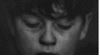

# Emotional classification and Painting rendering system based on Biological signals

Download Link : [Paper](https://drive.google.com/file/d/1ar9R1RwwCOPMbPviZfNuvDVif1Et_eYj/view?usp=sharing) (Korean)

**This repository contains code implementation about our paper "*Emotional classification and Painting rendering system based on Biological signals*".**

**3rd AI-humanity Academic Competition 2nd place Award 🥈 (Excellence Award)**


### Our Team 
 - **Nahyuk Lee** 🙋‍♂️ (School of Computer Science & Engineering, Chung-Ang Univ.)
 - Yeeun Hwang (School of Business Administration, Chung-Ang Univ.)
 - Yein Moon (School of Electrical and Electronics Engineering, Chung-Ang Univ.)
 - Yuri So (Department of Applied Statistics, Chung-Ang Univ.)


## Application
### Example 01 : In Timelaps Video
The graph visualizes how the sensibilities of 'happy', 'press', 'angry' and 'comfort' change over time.


### Example 02 : In 1 minute Movie Scene
The graph shows that the color contrast between green and red shows that the scene effectively reveals emotional changes.


## System Flow
The system flow of our project is as follows. 

### a) K-means Clustering for color
Groups have been formed to ensure that the color spectrum is well representative of the color information of a single image, while maintaining the degree to which the operation speed is not too slow. Thg color spectrum data clustered into five groups were used to analyze images and to use them in the course of future machine learning.


### b) Extracting emotion
Through k-mean clustering, five color information clustered and its ratio determined the RGB color information of the image. The color difference was calculated using Euclidean distance. The harmonization of colors is generally indicated by the coloration relationship, and we calculated and measured the relationship with the adjacent color.

| **Type** | **Date** | **R_avg** | **G_avg** | **B_avg** | **Color_Var** | **V_Var** | **S_Var** | **Label** |
|:--------:|:--------:|:--------:|:--------:|:--------:| :--------:|:--------:|:--------:|:--------:|
|  |  | 41.2 | 6.3 | 4.1 | 8428.3 | 24893.5 | 0.4 | **2 (Passion)** |
|  |  | 9.9 | 9.9 | 9.9 | 2311.1 | 3618.5 | 0.0 | **1 (Depress)** |
|  |  | 41.0 | 33.2 | 34.7 | 10127.2 | 17885.0 | 0.1 | **0 (Happy)** | 
|  |  | 34.7 | 40.0 | 45.2 | 5702.1 | 30707.2 | 0.1 | **3 (Comport)** |

The feature information we used for mechanical learning is as shown in Table. The spectrum was extracted for a given image and the characteristics and labels for each were matched. The labels are numbered 0, 1, 2, 3 and each means happy, depress, passion, and comport.

### c) Machine Learning
Emotional classification models were produced through the representative classification learning algorithms, Decision Tree, Random Forest, and Logistic Regression. The line was optimized by tuning the hyper parameter of the classification model.

## Code

### Install dependencies
We recommend you to use Anaconda that already including mandotory packages. 
```
python -m pip install -r requirements.txt
```
Our code was tested with Python 3.6.

### Data Preprocessing
Before you extract color spectrum from Video, you should split it by the command below,
```
python split_video.py
```

Then, you can extract color spectrums from frames, and calculate features for your training.
```
python video_analysis.py
```

### Training model & Check Result
To train  classification models with preprocessed dataset, you can handle IPython notebook with 'training.ipynb'.

## References
- O. Icoglu, B.Gunsel, B. and S. Sariel, “Classification and indexing of paintings based on art movements”. Signal Processing Conference 12th European, 2004
- J. Zujovic, L. Gandy, S. Friedman, B. Pardo, and T.N. Pappas, “Classifying paintings by artistic genre: An analysis of features and classifiers.”, Multimedia Signal Processing IEEE International Workshop on 2009, 2009.
- T. Lee, H. Lim, D. Kim, S. Hwang, and K. Yoon, “System for Matching Paintings with Music based on Emotion”s, In Technical Brief of the Siggraph Asia, 2016.
- H.G. Chambers,“Clothing selection “, Prentice-Hall, 1978
- N. Kolenda, The Psychology of Color. Kolenda Entertainment LLC, 2016.
- S. Kobayashi. “The aim and method of the Color Image Scale”, Color Research and Application,6: 93–107, 1981.
- D. Patil, “Coloring Consumer's Psychology Using Different Shades the Role of Perception of Colors by Consumersin Consumer Decision Making Process:a Micro Study of Select Departmental Stores in Mumbai City,India,” Journal of Business & Retail Management Research,7(1),60-73, 2012.


